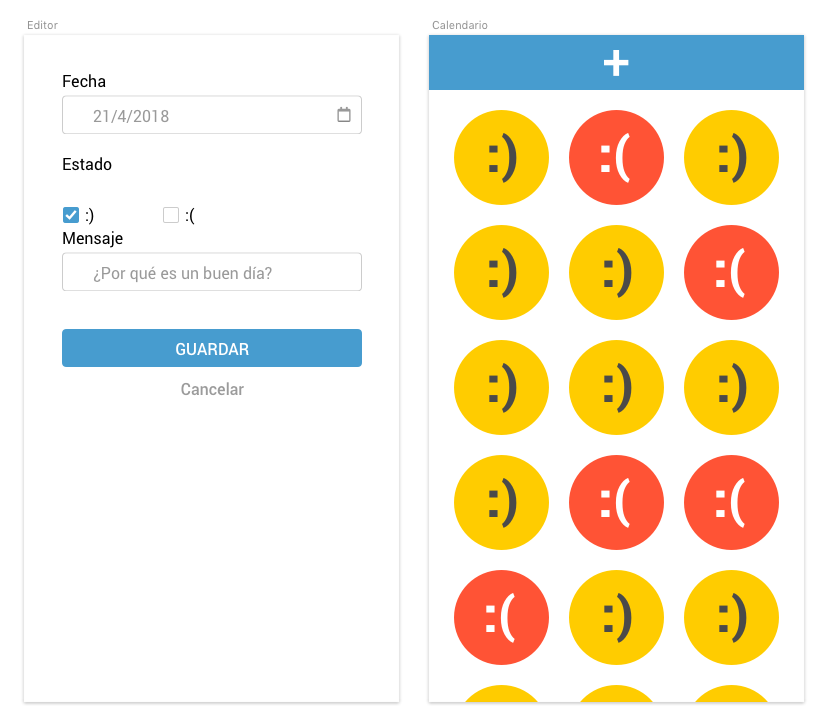

# Prueba técnica #3

En esta prueba vamos a crear una pequeña webapp en React basada en el Life Calendar de Brigada Creativa.

Se trata de un calendario en el que cada día vas apuntado qué tal ha ido el día eligiendo un smiley. La idea es poder ver un periodo de tiempo en contexto para que los días malos no puedan a los buenos.

## Sobre la autora:

Puedes espiarme en:

## Guía gráfica
Esta imagen es una guía para hacernos una idea de cómo debería quedar:

## Especificaciones
Tendremos una serie de reglas:

- Solo hay dos opciones, día bueno o día malo:  :) ó :(
- En el caso de un buen día, :), se podrá añadir un mensaje
- Una vez guardado un día ya no se puede editar
- Esta vez no es necesario gestionar los huecos (si me dejo X días sin añadir)
- Navegación:
  - Hay dos vistas, la vista de edición y la del listado de días
  - Se accede al editor con el botón + que aparece fijo en la parte superior de la pantalla
  - Los botones guardar/cancelar devuelven a la vista de listado
  - Los datos se guardarán en el local storage del navegador ;)
